<div align="center">

# 🍽️ One-Click Restaurant Management System

### **A Modern, Full-Stack Restaurant Management Solution with Real-Time Order Tracking**

[](https://www.typescriptlang.org/)
[](https://reactjs.org/)
[](https://nodejs.org/)
[](https://www.mongodb.com/)
[](https://www.docker.com/)
[](https://socket.io/)

[](LICENSE)
[](.github/workflows)
[]()

**Streamline your restaurant operations with a comprehensive, real-time management system that connects customers, kitchen, cashiers, and administrators seamlessly.**

[Features](#-key-features) • [Screenshots](#-interface-screenshots) • [Quick Start](#-quick-start) • [Documentation](#-documentation) • [API Reference](#-api-documentation) • [Deployment](#-deployment)

---

</div>

## 📑 Table of Contents

- [✨ Key Features](#-key-features)
- [📸 Interface Screenshots](#-interface-screenshots)
- [🏗️ Architecture](#️-architecture)
- [🚀 Quick Start](#-quick-start)
  - [Docker Deployment](#option-1-docker-deployment-recommended)
  - [Local Development](#option-2-local-development)
- [⚙️ Configuration](#️-configuration)
- [📚 API Documentation](#-api-documentation)
- [🧪 Testing](#-testing)
- [🔐 Security](#-security)
- [🚢 Deployment](#-deployment)
- [🛠️ Technology Stack](#️-technology-stack)
- [📁 Project Structure](#-project-structure)
- [🤝 Contributing](#-contributing)
- [📄 License](#-license)

---

## ✨ Key Features

### 🎯 **Multi-Interface System**

<table>
<tr>
<td width="50%">

#### 👥 **Customer Interface**
- 📱 QR Code table scanning
- 🍕 Interactive menu browsing
- 🛒 Real-time cart management
- 📊 Live order status tracking
- 🔔 Table service requests (bell/bill)
- 💳 Multiple payment methods

</td>
<td width="50%">

#### 💰 **Cashier Dashboard**
- 📋 Real-time order management
- 💵 Payment processing (Cash/Card)
- 🧾 Bill generation & printing
- 📊 Shift management (Cash In/Out)
- 📈 Daily sales analytics
- 🔐 Secure authentication

</td>
</tr>
<tr>
<td width="50%">

#### 👨‍🍳 **Kitchen Display**
- ⚡ Instant order notifications
- 🔄 Real-time status updates
- 🔊 Sound alerts for new orders
- 📱 Touch-friendly interface
- ⏱️ Order timing tracking
- ✅ Order completion workflow

</td>
<td width="50%">

#### 👨‍💼 **Admin Panel**
- 🍽️ Complete menu management (CRUD)
- 📂 Category organization
- 🪑 Table configuration
- 👤 Cashier management
- 📊 Comprehensive analytics
- 📝 Activity logging

</td>
</tr>
</table>

### 🔄 **Real-Time Capabilities**

- ⚡ **WebSocket Integration**: Live synchronization across all interfaces
- 🔔 **Instant Notifications**: Real-time order updates and alerts
- 📡 **Socket.IO**: Bidirectional communication for seamless UX
- 🔄 **Auto-Sync**: Automatic data synchronization without page refresh

### 🐳 **DevOps & Infrastructure**

- 🐳 **Docker Support**: Fully containerized with multi-stage builds
- 🔄 **CI/CD Pipeline**: Automated testing and deployment
- 📦 **Production Ready**: Optimized builds and configurations
- 🔒 **Environment Management**: Secure configuration handling

---

## 📸 Interface Screenshots

### **Admin Interface**

<div align="center">

| Admin Dashboard | Admin Settings | Analytics |
|:---:|:---:|:---:|
| 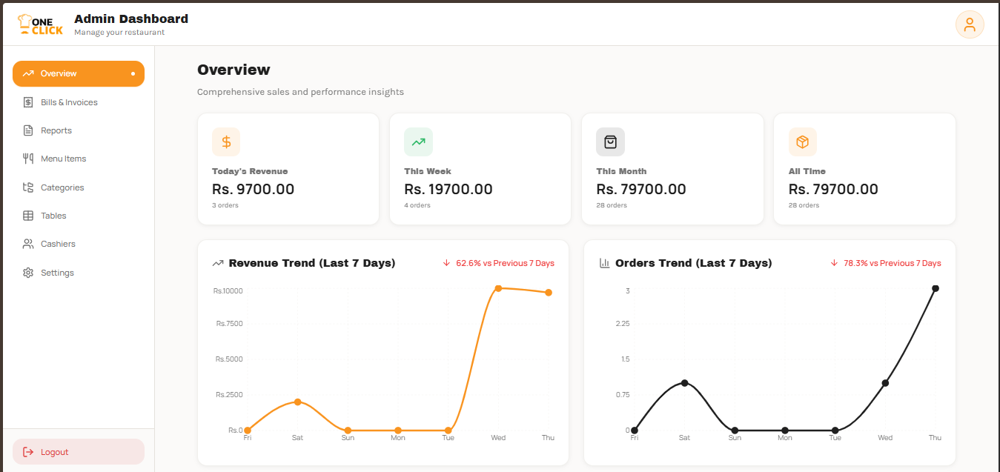 | 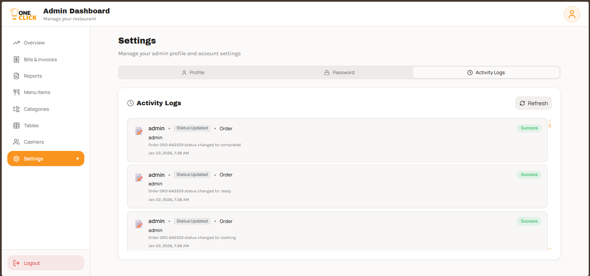 | 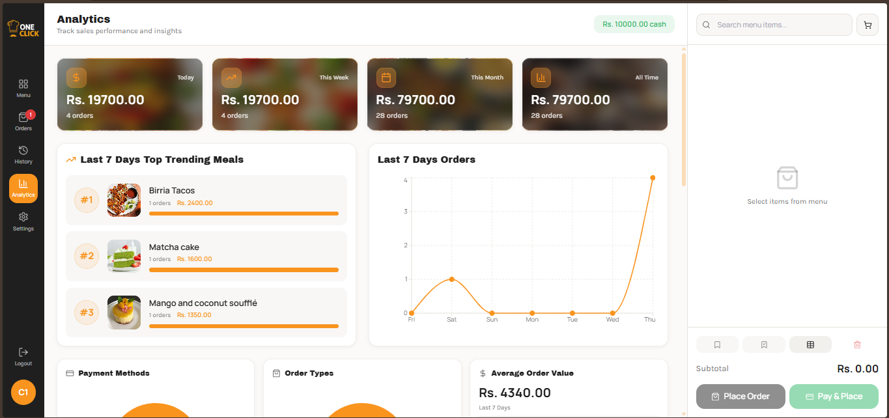 |

| Menu Management | Category Management | Table Management |
|:---:|:---:|:---:|
| 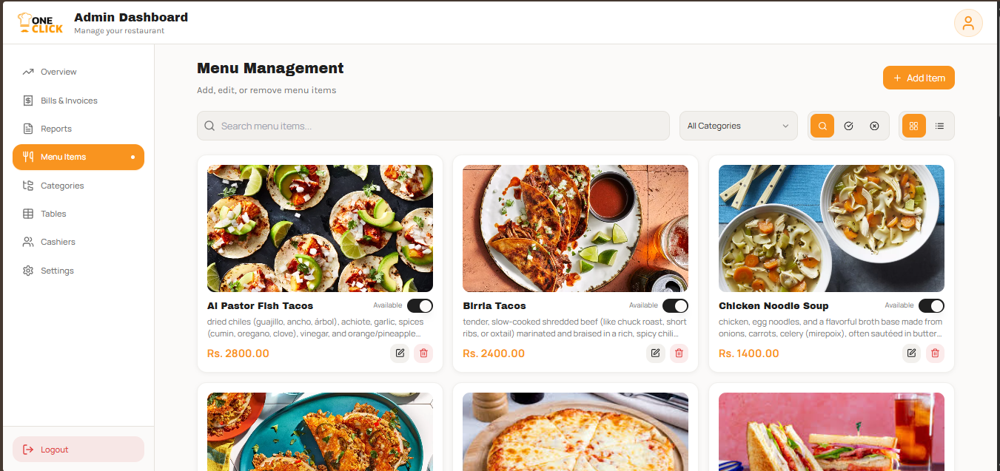 | 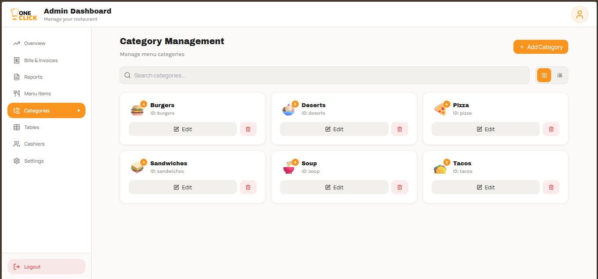 | 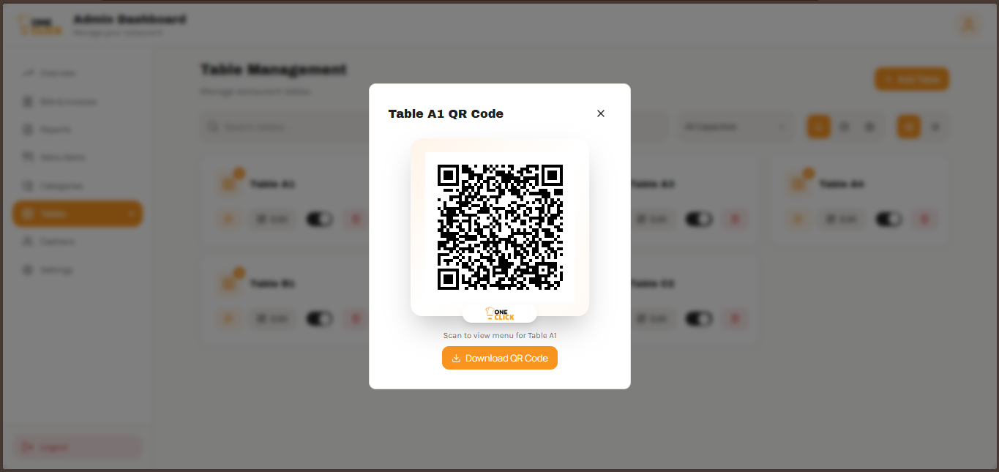 |

| Sales Report | Bill & Invoice | History |
|:---:|:---:|:---:|
| 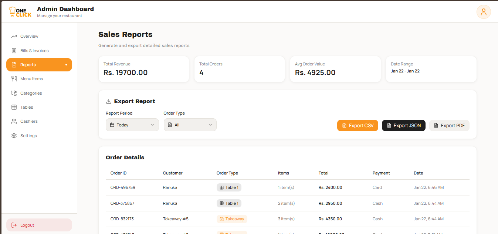 | 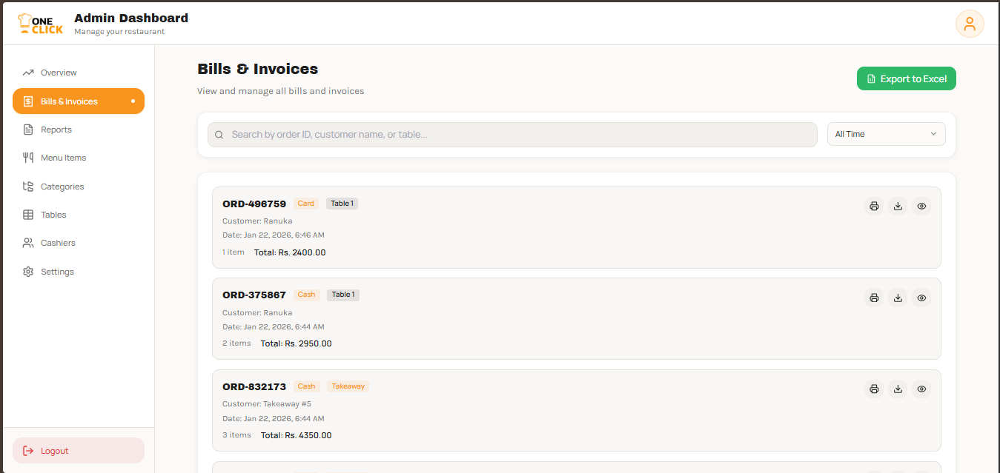 | 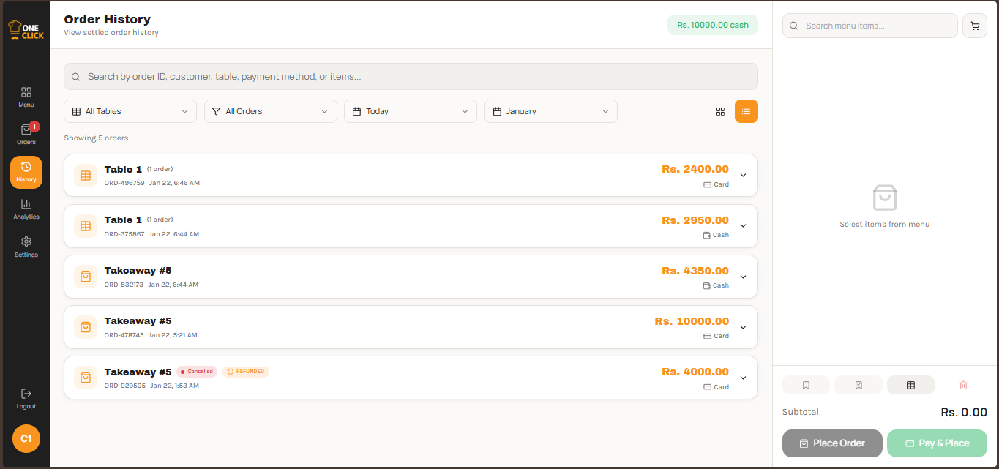 |

</div>

### **Cashier Interface**

<div align="center">

| Cashier Dashboard | Cashier Login | Cashier Logout |
|:---:|:---:|:---:|
| 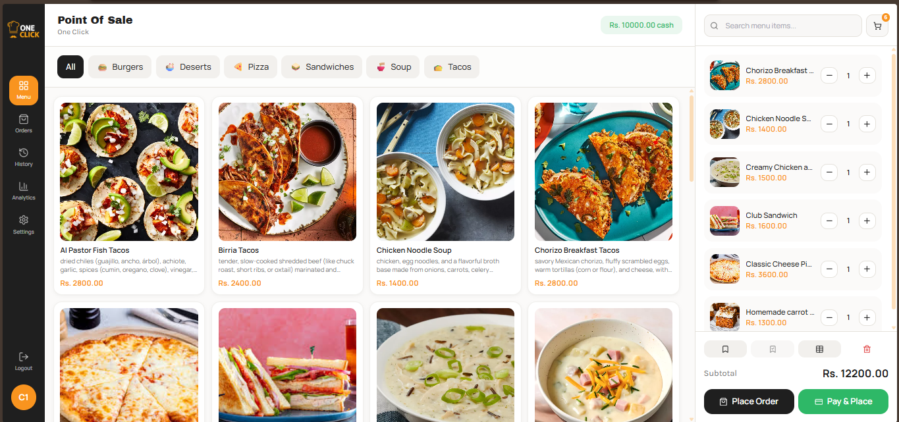 | 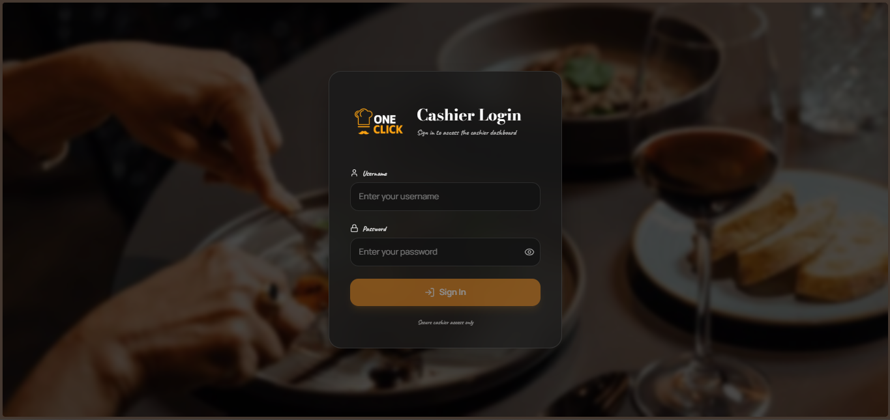 | 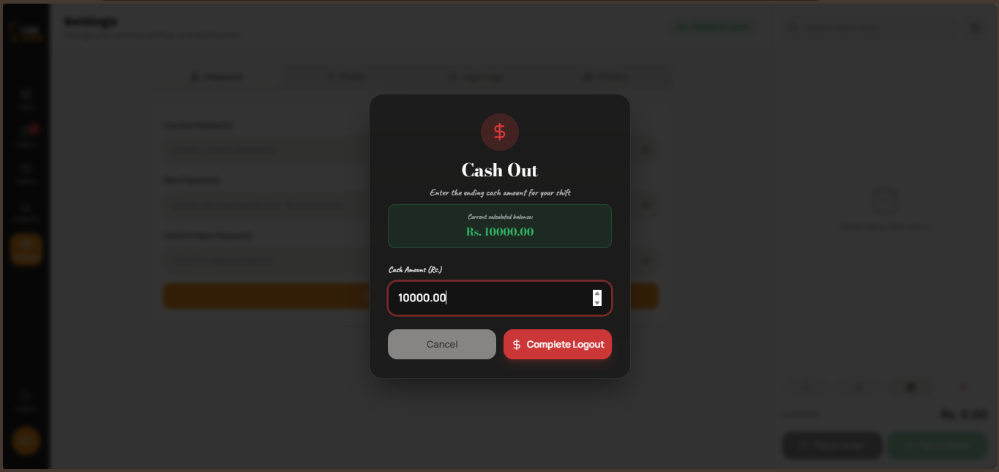 |

| Cashier Management | Cashier Settings | Order Management |
|:---:|:---:|:---:|
| 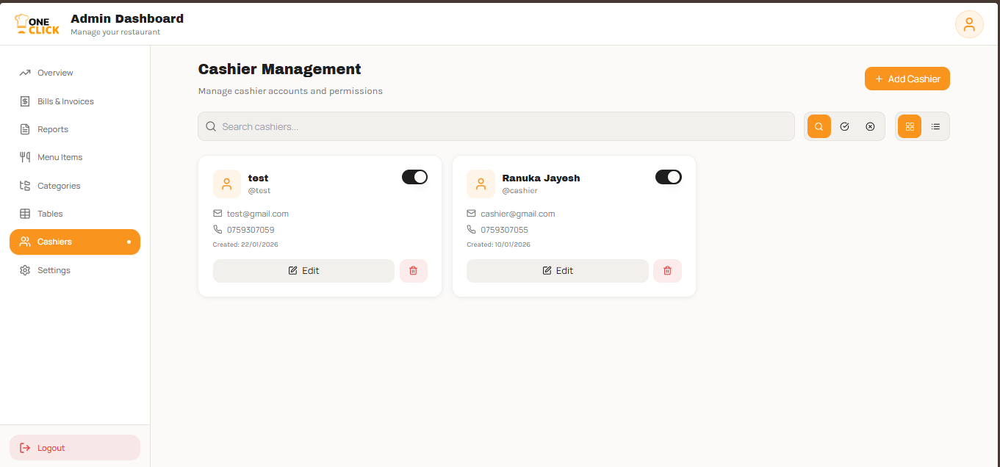 | 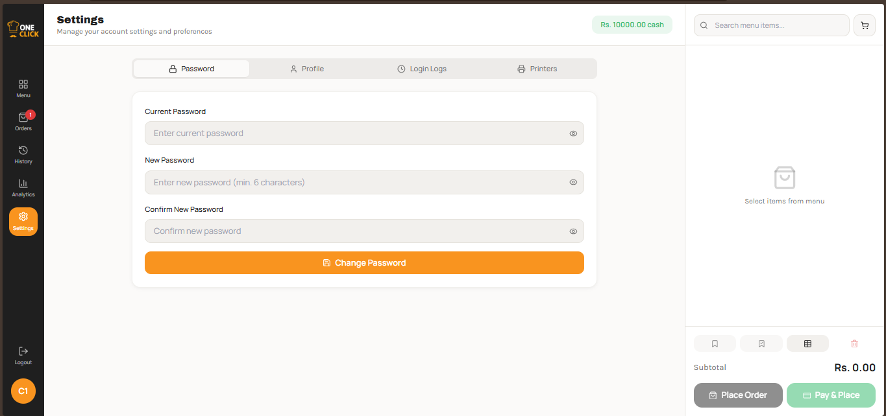 | 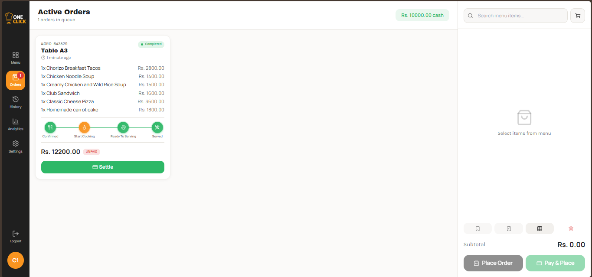 |

</div>

### **Customer & Kitchen Interface**

<div align="center">

| Customer Entrance | Customer Menu | Customer Menu 2 |
|:---:|:---:|:---:|
| 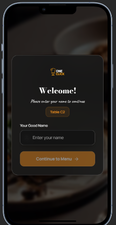 | 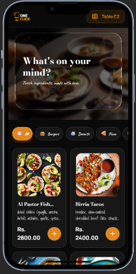 | 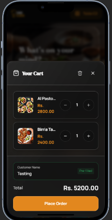 |

| Kitchen Display | Table Reserve |
|:---:|:---:|
|  | 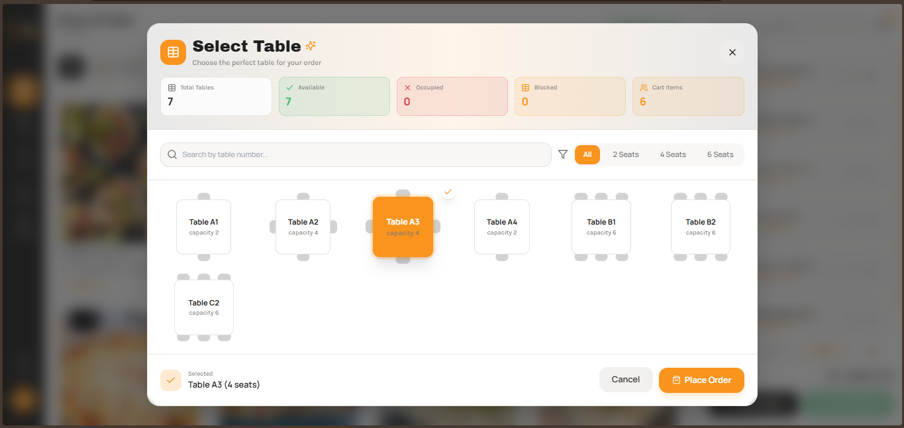 |

</div>

---

## 🏗️ Architecture

```
┌─────────────────────────────────────────────────────────────┐
│                    Restaurant Management System              │
└─────────────────────────────────────────────────────────────┘
                              │
        ┌─────────────────────┼─────────────────────┐
        │                     │                       │
        ▼                     ▼                       ▼
┌──────────────┐      ┌──────────────┐      ┌──────────────┐
│   Frontend   │      │    Backend   │      │   Database   │
│   (React)    │◄────►│   (Express)  │◄────►│  (MongoDB)   │
│              │      │              │      │              │
│  Port: 8080  │      │  Port: 3000  │      │   Atlas/Local│
└──────────────┘      └──────────────┘      └──────────────┘
        │                     │
        │                     │
        └──────────┬───────────┘
                   │
                   ▼
        ┌──────────────────┐
        │   Socket.IO      │
        │  (WebSocket)     │
        │  Real-time Sync  │
        └──────────────────┘
```

### **System Flow**

```
Customer → Place Order → Backend API → Database
                              │
                              ▼
                    Socket.IO Broadcast
                              │
        ┌─────────────────────┼─────────────────────┐
        │                     │                       │
        ▼                     ▼                       ▼
   Kitchen Display      Cashier Dashboard      Customer Screen
   (New Order)          (Order Update)        (Status Change)
```

---

## 🚀 Quick Start

### **Prerequisites**

- ✅ **Node.js** 20+ ([Download](https://nodejs.org/))
- ✅ **Docker** & **Docker Compose** ([Install Guide](https://docs.docker.com/get-docker/))
- ✅ **MongoDB Atlas** account ([Sign Up](https://www.mongodb.com/cloud/atlas)) or Local MongoDB
- ✅ **Git** ([Download](https://git-scm.com/))

---

### **Option 1: Docker Deployment (Recommended)**

<details>
<summary><b>📦 Click to expand Docker setup instructions</b></summary>

#### **Step 1: Clone Repository**

```bash
git clone <your-repository-url>
cd one-click
```

#### **Step 2: Configure Environment**

```bash
# Copy example environment file
cp env.example .env

# Edit .env with your MongoDB credentials
nano .env  # or use your preferred editor
```

#### **Step 3: Start Services**

```bash
# Build and start all containers
docker-compose up -d --build

# View logs
docker-compose logs -f

# Check service status
docker-compose ps
```

#### **Step 4: Access Application**

- 🌐 **Frontend**: http://localhost:8080
- 🔌 **Backend API**: http://localhost:3000
- ❤️ **Health Check**: http://localhost:3000/health

#### **Useful Docker Commands**

```bash
# Stop all services
docker-compose down

# Restart services
docker-compose restart

# View specific service logs
docker-compose logs -f frontend
docker-compose logs -f backend

# Rebuild specific service
docker-compose up -d --build frontend

# Production deployment
docker-compose -f docker-compose.prod.yml up -d --build
```

</details>

---

### **Option 2: Local Development**

<details>
<summary><b>💻 Click to expand local development setup</b></summary>

#### **Step 1: Install Dependencies**

```bash
npm install
```

#### **Step 2: Environment Configuration**

Create a `.env` file in the root directory:

```env
# MongoDB Configuration
MONGODB_USERNAME=your-username
MONGODB_PASSWORD=your-password
MONGODB_CLUSTER=your-cluster.mongodb.net
MONGODB_USE_ATLAS=true
DB_NAME=restaurant
MONGODB_APP_NAME=restaurant-cluster

# Server Configuration
PORT=3000
NODE_ENV=development

# Frontend Configuration
VITE_API_URL=http://localhost:3000/api
VITE_SERVER_URL=http://localhost:3000

# Security
JWT_SECRET=your-secret-key-change-this-in-production
```

#### **Step 3: Start Development Servers**

```bash
# Start both frontend and backend simultaneously
npm run dev:all

# Or start separately:
npm run dev          # Frontend (http://localhost:8080)
npm run dev:server   # Backend (http://localhost:3000)
```

#### **Step 4: Build for Production**

```bash
# Build frontend
npm run build

# Build backend
npm run build:server

# Build both
npm run build:all
```

</details>

---

## ⚙️ Configuration

### **Environment Variables**

<details>
<summary><b>🔧 Click to view all environment variables</b></summary>

| Variable | Description | Default | Required |
|----------|-------------|---------|----------|
| `MONGODB_USERNAME` | MongoDB Atlas username | - | ✅ |
| `MONGODB_PASSWORD` | MongoDB Atlas password | - | ✅ |
| `MONGODB_CLUSTER` | MongoDB cluster URL | - | ✅ |
| `MONGODB_USE_ATLAS` | Use Atlas (true) or Local (false) | `true` | ✅ |
| `DB_NAME` | Database name | `restaurant` | ❌ |
| `PORT` | Backend server port | `3000` | ❌ |
| `NODE_ENV` | Environment mode | `development` | ❌ |
| `VITE_API_URL` | Frontend API base URL | `http://localhost:3000/api` | ❌ |
| `VITE_SERVER_URL` | WebSocket server URL | `http://localhost:3000` | ❌ |
| `JWT_SECRET` | JWT signing secret | - | ✅ (Production) |

</details>

### **MongoDB Setup**

<details>
<summary><b>🗄️ Click for MongoDB configuration guide</b></summary>

#### **Option A: MongoDB Atlas (Cloud)**

1. Create account at [MongoDB Atlas](https://www.mongodb.com/cloud/atlas)
2. Create a new cluster (Free tier available)
3. Create database user with read/write permissions
4. Whitelist your IP address (or `0.0.0.0/0` for development)
5. Get connection string and update `.env`

#### **Option B: Local MongoDB**

1. Install MongoDB locally ([Download](https://www.mongodb.com/try/download/community))
2. Start MongoDB service
3. Set `MONGODB_USE_ATLAS=false` in `.env`
4. Update connection string for local instance

</details>

---

## 📚 API Documentation

### **Base URLs**

- **Development**: `http://localhost:3000/api`
- **Production**: `https://your-domain.com/api`

### **Authentication Endpoints**

<details>
<summary><b>🔐 Click to view authentication endpoints</b></summary>

#### **Admin Login**
```http
POST /api/admin/login
Content-Type: application/json

{
  "username": "admin",
  "password": "password"
}
```

#### **Cashier Login**
```http
POST /api/admin/cashier/login
Content-Type: application/json

{
  "username": "cashier1",
  "password": "password"
}
```

#### **Change Password**
```http
POST /api/admin/change-password
Content-Type: application/json

{
  "username": "admin",
  "currentPassword": "oldpass",
  "newPassword": "newpass"
}
```

**New setup with no users?** Set `SEED_DEFAULT_ADMIN=true` (and optionally `DEFAULT_ADMIN_USERNAME`, `DEFAULT_ADMIN_PASSWORD`) in `.env` before starting. The app will create a default admin when the `users` collection is empty.

</details>

### **Menu Management**

<details>
<summary><b>🍽️ Click to view menu endpoints</b></summary>

| Method | Endpoint | Description |
|--------|----------|-------------|
| `GET` | `/api/admin/menu-items` | List all menu items |
| `POST` | `/api/admin/menu-items` | Create menu item |
| `PUT` | `/api/admin/menu-items/:id` | Update menu item |
| `DELETE` | `/api/admin/menu-items/:id` | Delete menu item |
| `POST` | `/api/admin/menu-items/upload-image` | Upload menu image |
| `GET` | `/api/admin/menu-items/categories` | List categories |
| `POST` | `/api/admin/menu-items/categories` | Create category |

</details>

### **Order Management**

<details>
<summary><b>📦 Click to view order endpoints</b></summary>

| Method | Endpoint | Description |
|--------|----------|-------------|
| `GET` | `/api/orders` | List orders (with filters) |
| `POST` | `/api/orders` | Create new order |
| `GET` | `/api/orders/:id` | Get order details |
| `PATCH` | `/api/orders/:id/status` | Update order status |
| `PATCH` | `/api/orders/:id/payment` | Mark order as paid |
| `DELETE` | `/api/orders/:id` | Cancel order |

</details>

### **Cashier Management**

<details>
<summary><b>👤 Click to view cashier endpoints</b></summary>

| Method | Endpoint | Description |
|--------|----------|-------------|
| `GET` | `/api/admin/cashiers` | List all cashiers |
| `POST` | `/api/admin/cashiers` | Create cashier |
| `PUT` | `/api/admin/cashiers/:id` | Update cashier |
| `DELETE` | `/api/admin/cashiers/:id` | Delete cashier |
| `PATCH` | `/api/admin/cashiers/:id/status` | Toggle active status |
| `POST` | `/api/admin/cashier/cash-in` | Start shift (Cash In) |
| `POST` | `/api/admin/cashier/cash-out` | End shift (Cash Out) |
| `GET` | `/api/admin/cashier/shifts/:cashierId` | Get shift history |

</details>

### **Table Management**

<details>
<summary><b>🪑 Click to view table endpoints</b></summary>

| Method | Endpoint | Description |
|--------|----------|-------------|
| `GET` | `/api/admin/tables` | List all tables |
| `POST` | `/api/admin/tables` | Create table |
| `PUT` | `/api/admin/tables/:id` | Update table |
| `DELETE` | `/api/admin/tables/:id` | Delete table |
| `PATCH` | `/api/admin/tables/:id/availability` | Toggle availability |

</details>

### **Health Check**

```http
GET /health
```

**Response:**
```json
{
  "status": "ok",
  "timestamp": "2024-01-01T00:00:00.000Z",
  "uptime": 3600
}
```

---

## 🧪 Testing

<details>
<summary><b>🧪 Click to view testing commands</b></summary>

### **Run Tests**

```bash
# Run all server unit tests
npm run test:server

# Run integration tests
npm run test:integration

# Run all tests
npm run test

# Watch mode (development)
npm run test:watch
```

### **Linting**

```bash
# Check code quality
npm run lint

# Auto-fix issues
npm run lint -- --fix
```

### **Test Coverage**

The project includes comprehensive test coverage for:
- ✅ Backend API routes
- ✅ Database connections
- ✅ Integration scenarios
- ✅ Error handling

</details>

---

## 🔐 Security

<details>
<summary><b>🔒 Click to view security features</b></summary>

### **Implemented Security Measures**

- 🔐 **Passwords**: Plain-text storage (no encryption)
- 🛡️ **Authentication**: Secure login for admin and cashiers
- 🔑 **Protected Routes**: Role-based access control
- 🔒 **Environment Variables**: Sensitive data in `.env`
- ✅ **Input Validation**: Backend validation for all inputs
- 🚫 **SQL Injection Protection**: MongoDB parameterized queries
- 🔐 **CORS Configuration**: Controlled cross-origin requests

### **Best Practices**

1. **Never commit `.env` files** to version control
2. **Use strong passwords** for production
3. **Rotate JWT secrets** regularly
4. **Keep dependencies updated**
5. **Enable MongoDB authentication**
6. **Use HTTPS in production**

</details>

---

## 🚢 Deployment

<details>
<summary><b>☁️ Click to view deployment options</b></summary>

### **Production Docker Deployment**

```bash
# Build and start production containers
docker-compose -f docker-compose.prod.yml up -d --build

# Access:
# Frontend: http://your-domain (port 80)
# Backend: http://your-domain:3000
```

### **Cloud Platform Deployment**

#### **Frontend (Vercel/Netlify)**

1. Connect your GitHub repository
2. Set build command: `npm run build`
3. Set output directory: `dist`
4. Add environment variables
5. Deploy!

#### **Backend (Railway/Render)**

1. Connect your GitHub repository
2. Set build command: `npm run build:server`
3. Set start command: `npm run start:prod`
4. Add environment variables
5. Deploy!

#### **Database (MongoDB Atlas)**

1. Create production cluster
2. Configure network access
3. Create production user
4. Update connection string in `.env`

</details>

---

## 🛠️ Technology Stack

<details>
<summary><b>💻 Click to view complete tech stack</b></summary>

### **Frontend**

| Technology | Version | Purpose |
|-----------|---------|---------|
| **React** | 18.3+ | UI Framework |
| **TypeScript** | Latest | Type Safety |
| **Vite** | Latest | Build Tool |
| **Tailwind CSS** | Latest | Styling |
| **shadcn/ui** | Latest | UI Components |
| **Zustand** | Latest | State Management |
| **React Query** | Latest | Server State |
| **Socket.IO Client** | 4.8+ | Real-time Communication |
| **React Router** | 6.30+ | Routing |
| **Recharts** | Latest | Data Visualization |

### **Backend**

| Technology | Version | Purpose |
|-----------|---------|---------|
| **Node.js** | 20+ | Runtime |
| **Express** | 4.21+ | Web Framework |
| **TypeScript** | Latest | Type Safety |
| **MongoDB** | 7.0+ | Database |
| **Socket.IO** | 4.8+ | WebSocket Server |
| **Multer** | Latest | File Uploads |
| **CORS** | Latest | Cross-Origin |

### **DevOps & Tools**

| Technology | Purpose |
|-----------|---------|
| **Docker** | Containerization |
| **Docker Compose** | Multi-container orchestration |
| **GitHub Actions** | CI/CD Pipeline |
| **Vitest** | Testing Framework |
| **ESLint** | Code Linting |
| **Nginx** | Production reverse proxy |

</details>

---

## 📁 Project Structure

<details>
<summary><b>📂 Click to view project structure</b></summary>

```
one-click/
├── .github/
│   └── workflows/
│       └── ci.yml                 # CI/CD pipeline
├── public/                        # Static assets
│   ├── favicon.ico
│   └── logo.png
├── server/                        # Backend application
│   ├── config/
│   │   └── database.ts           # MongoDB configuration
│   ├── routes/
│   │   ├── admin.ts              # Admin routes
│   │   ├── menuItems.ts          # Menu management
│   │   └── orders.ts             # Order management
│   ├── utils/
│   │   ├── password.ts           # Password utilities (plain-text)
│   │   ├── websocket.ts          # Socket.IO server
│   │   ├── adminLogs.ts          # Admin activity logs
│   │   └── cashierLogs.ts       # Cashier activity logs
│   ├── __tests__/                # Backend tests
│   └── index.ts                  # Server entry point
├── src/                          # Frontend application
│   ├── components/               # React components
│   │   ├── ui/                   # shadcn/ui components
│   │   ├── Analytics.tsx         # Analytics dashboard
│   │   ├── Settings.tsx          # Settings panel
│   │   └── ...
│   ├── pages/                    # Route pages
│   │   ├── CustomerMenu.tsx      # Customer interface
│   │   ├── CashierDashboard.tsx # Cashier dashboard
│   │   ├── KitchenDisplay.tsx   # Kitchen display
│   │   └── AdminDashboard.tsx   # Admin panel
│   ├── stores/                   # Zustand stores
│   │   └── orderStore.ts        # Order state management
│   ├── utils/                    # Utility functions
│   │   ├── api.ts               # API client
│   │   ├── socketService.ts     # Socket.IO client
│   │   └── websocket.ts         # WebSocket utilities
│   └── types/                    # TypeScript types
│       └── order.ts             # Order type definitions
├── tests/                        # Integration tests
│   └── integration/
│       └── health.test.ts       # Health check tests
├── uploads/                      # Uploaded files
├── Dockerfile.frontend          # Frontend Dockerfile
├── Dockerfile.backend           # Backend Dockerfile
├── docker-compose.yml           # Development compose
├── docker-compose.prod.yml      # Production compose
├── docker-compose.test.yml      # Testing compose
├── nginx.conf                   # Nginx configuration
├── package.json                 # Dependencies
├── tsconfig.json                # TypeScript config
└── README.md                    # This file
```

</details>

---

## 🤝 Contributing

<details>
<summary><b>💡 Click to view contribution guidelines</b></summary>

We welcome contributions! Please follow these steps:

1. **Fork the repository**
2. **Create a feature branch**
   ```bash
   git checkout -b feature/amazing-feature
   ```
3. **Make your changes**
4. **Run tests**
   ```bash
   npm run test:server && npm run test:integration
   ```
5. **Commit your changes**
   ```bash
   git commit -m "Add amazing feature"
   ```
6. **Push to branch**
   ```bash
   git push origin feature/amazing-feature
   ```
7. **Open a Pull Request**

### **Code Style**

- Follow TypeScript best practices
- Use meaningful variable names
- Add comments for complex logic
- Write tests for new features
- Update documentation as needed

</details>

---

## 📄 License

This project is licensed under the MIT License - see the [LICENSE](LICENSE) file for details.

---

## 👥 Contributors

<div align="center">

### **🌟 Our Amazing Development Team**

<table>
<tr>
<td align="center" valign="top">
<a href="https://github.com/Ranuka-Jayesh">

<br />
<br />
<sub><b>👨‍💻 Ranuka Jayesh</b></sub>
<br />
<sub>🏆 Founder & Lead Developer</sub>
</a>
<br />
<br />
<a href="https://github.com/Ranuka-Jayesh" style="text-decoration: none;">

</a>
</td>
<td align="center" valign="top">
<a href="https://github.com/MPrajakaruna">

<br />
<br />
<sub><b>💻 R.Y.M.M.P.Rajakaruna</b></sub>
<br />
<sub>🚀 Developer</sub>
</a>
<br />
<br />
<a href="https://github.com/MPrajakaruna" style="text-decoration: none;">

</a>
</td>
<td align="center" valign="top">
<a href="https://github.com/AshenSuri">

<br />
<br />
<sub><b>⚡ Ashen Suriyabandara</b></sub>
<br />
<sub>🚀 Developer</sub>
</a>
<br />
<br />
<a href="https://github.com/AshenSuri" style="text-decoration: none;">

</a>
</td>
</tr>
<tr>
<td align="center" valign="top">
<a href="https://github.com/ruwanthac">

<br />
<br />
<sub><b>🎨 Ruwantha Bandara</b></sub>
<br />
<sub>🚀 Developer</sub>
</a>
<br />
<br />
<a href="https://github.com/ruwanthac" style="text-decoration: none;">

</a>
</td>
<td align="center" valign="top">
<a href="https://github.com/Denuwan10">

<br />
<br />
<sub><b>🔧 Denuwan</b></sub>
<br />
<sub>🚀 Developer</sub>
</a>
<br />
<br />
<a href="https://github.com/Denuwan10" style="text-decoration: none;">

</a>
</td>
<td align="center" valign="top">
<a href="https://github.com/yasasdulneth">

<br />
<br />
<sub><b>✨ Yasas Dulneth</b></sub>
<br />
<sub>🚀 Developer</sub>
</a>
<br />
<br />
<a href="https://github.com/yasasdulneth" style="text-decoration: none;">

</a>
</td>
</tr>
<tr>
<td align="center" valign="top" colspan="3">
<a href="https://www.ogotechnology.net">

<br />
<br />
<sub><b>🎨 OGO Technology</b></sub>
<br />
<sub>🎯 Interactive Design Developer</sub>
</a>
<br />
<br />
<a href="https://www.ogotechnology.net" style="text-decoration: none;">

</a>
</td>
</tr>
</table>

---

### **📋 Contributors List**

<table>
<tr>
<td align="center">
<a href="https://github.com/Ranuka-Jayesh">

</a>
</td>
<td align="center">
<a href="https://github.com/MPrajakaruna">

</a>
</td>
<td align="center">
<a href="https://github.com/AshenSuri">

</a>
</td>
</tr>
<tr>
<td align="center">
<a href="https://github.com/ruwanthac">

</a>
</td>
<td align="center">
<a href="https://github.com/Denuwan10">

</a>
</td>
<td align="center">
<a href="https://github.com/yasasdulneth">

</a>
</td>
</tr>
<tr>
<td align="center" colspan="3">
<a href="https://www.ogotechnology.net">

</a>
</td>
</tr>
</table>

**Made with ❤️ by an amazing team of developers**

</div>

---

## 🙏 Acknowledgments

- [OGO Technology](https://www.ogotechnology.net) for interactive design development
- [shadcn/ui](https://ui.shadcn.com/) for beautiful UI components
- [MongoDB Atlas](https://www.mongodb.com/cloud/atlas) for database hosting
- [Socket.IO](https://socket.io/) for real-time communication
- [Vite](https://vitejs.dev/) for blazing-fast build tool
- [Tailwind CSS](https://tailwindcss.com/) for utility-first CSS

---

## 📖 Additional Documentation

- 📘 **[System Overview](SYSTEM_OVERVIEW.md)** - Detailed architecture and design
- 🐳 **[Docker Guide](docker-compose.yml)** - Container configuration
- 🧪 **[Testing Guide](tests/)** - Test documentation
- 📝 **[UAT Template](UAT_TEMPLATE.md)** - User acceptance testing

---

<div align="center">

### **⭐ Star this repo if you find it helpful!**

**Made with ❤️ for the restaurant industry**

[⬆ Back to Top](#-one-click-restaurant-management-system)

</div>
